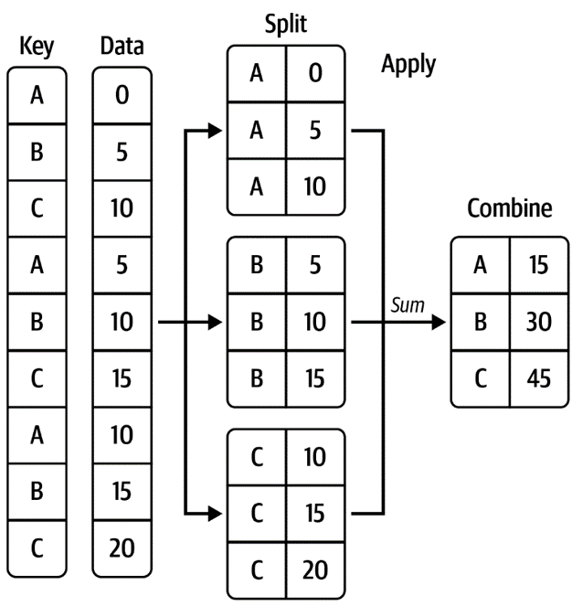

<h1>Portfolio</h1>

### Agregaciones con Pandas

Se analiza la sintaxis principal para hacer agregaciones con Pandas.

**Smart Working - Social Network and Content analysis**: social media analytics project realized with `.py`

This project focuses on the analysis of the Twitter community and sentiment regarding the enunciated topic. Through the API, 2667 tweets related to the selected keywords were collected from December 26, 2022 to January 5, 2023. After an initial preprocessing phase based on text mining techniques, a Social Network Analysis (Nodes Degree, Assortativity, Community Detection) and a Social Content Analysis (Sentiment Analysis, Emotion Recognition) were performed.

# Portfolio

### Experiencia Laboral
- Empresa1
- Empresa2

### Proyectos
- ¿Cómo hacer agregaciones en Pandas?
  Se analiza la sintaxis principal para hacer agregaciones con Pandas.
  
  [Enlace al proyecto](agregaciones/notebooks/Aggregations.ipynb)
  
- Proyecto2

### Publicaciones

- Publicaciones1
- Publicaciones2

